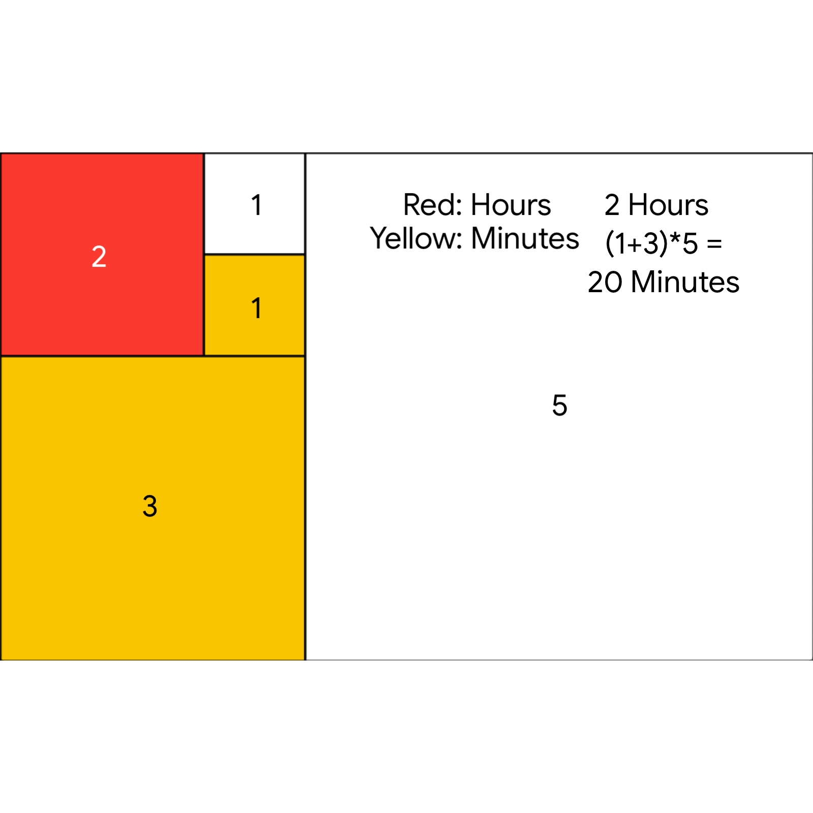

# Fibonacci-Clock

Processing (Java) implementation of the Fibonacci Clock, a project from [kickstarter](https://www.kickstarter.com/projects/basbrun/fibonacci-clock-an-open-source-clock-for-nerds-wit)

[Code](https://github.com/mikakruschel/fun-coding/tree/main/fibonacci-clock)

